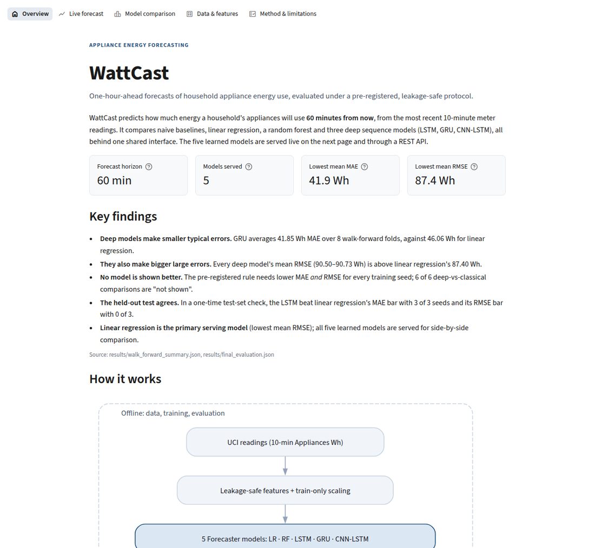
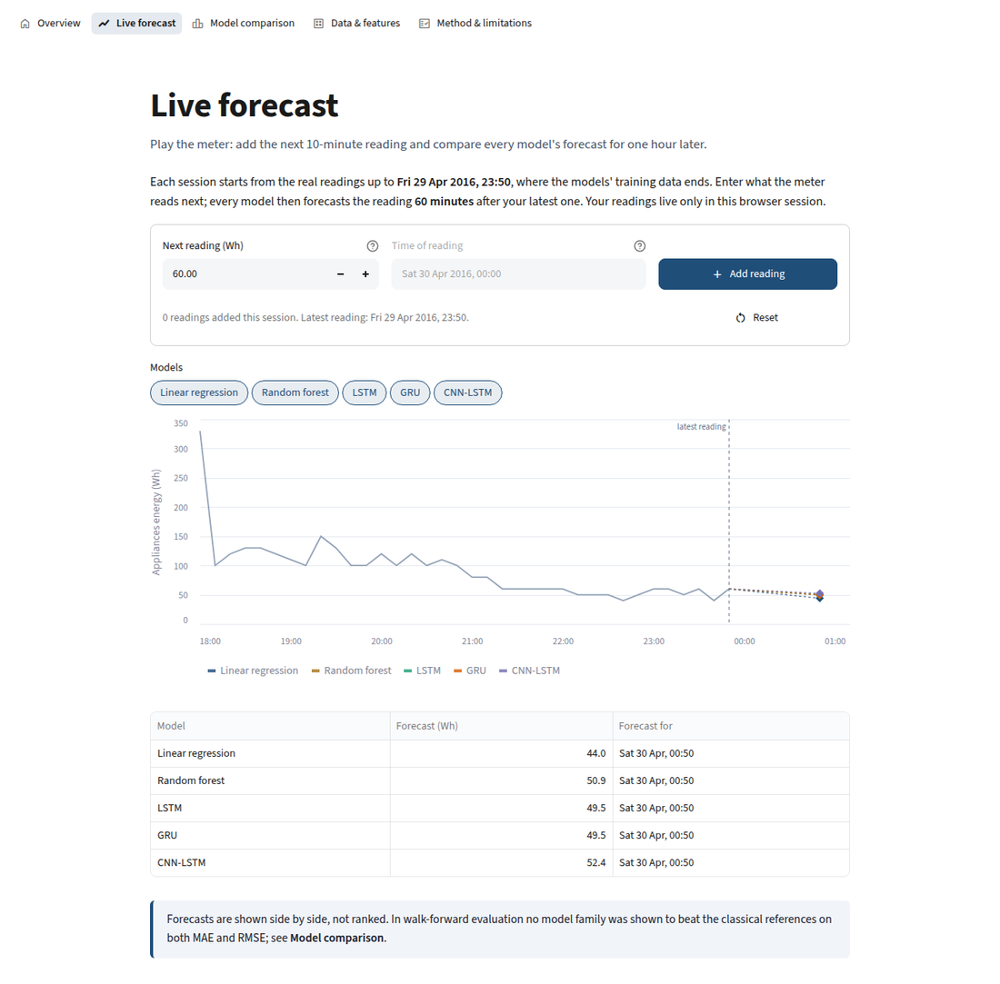
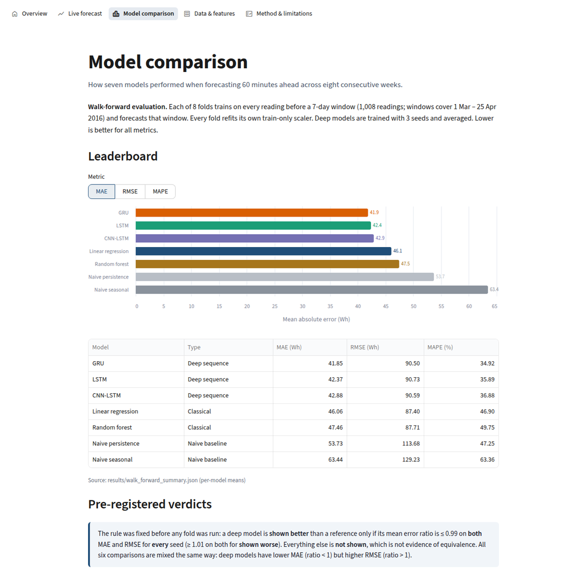
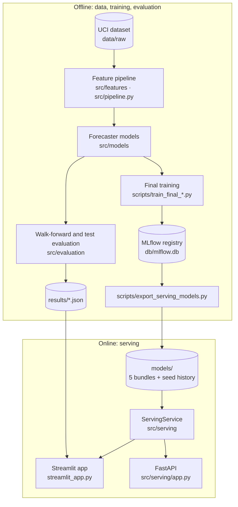
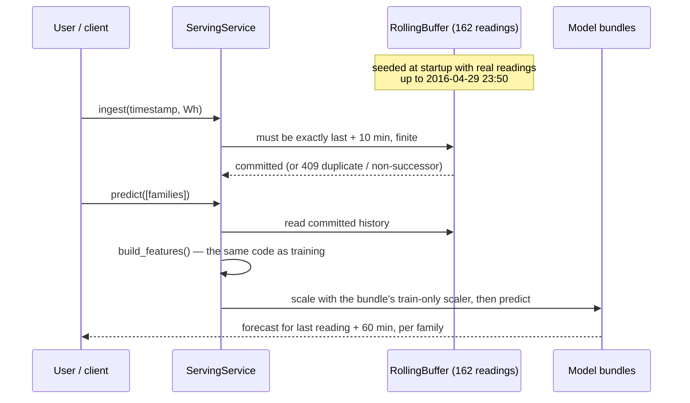

# WattCast

**One-hour-ahead forecasting of household appliance energy use, with a leakage-safe pipeline, a pre-registered model comparison, and a live Streamlit app.**

WattCast predicts the energy a household's appliances will use 60 minutes from now from recent 10-minute meter readings. It trains naive baselines, linear regression, a random forest and three PyTorch sequence models (LSTM, GRU, CNN-LSTM) behind one shared interface. It compares them with evaluation rules committed before the experiments ran, and serves the five learned models through a Streamlit app and a FastAPI service.



## Contents

[Problem](#problem) · [Features](#key-features) · [Results](#results-at-a-glance) · [Architecture](#architecture) · [Project structure](#project-structure) · [Quick start](#quick-start) · [Configuration](#configuration) · [Reproducing the results](#reproducing-the-results) · [Deployment](#deployment) · [API](#rest-api) · [Tech stack](#tech-stack) · [Design decisions](#design-decisions) · [Limitations](#limitations) · [Future work](#future-improvements) · [License](#license-and-data)

## Problem

Short-term appliance load forecasts support home energy management: when to shift loads, and when to expect a peak. Two things make this harder than it looks:

- **Leakage is easy.** Same-timestamp sensors, centred rolling windows, scalers fit on all data and random splits all let future information into features and produce optimistic scores that a live system cannot reproduce.
- **"Deep beats simple" is easy to overclaim.** With one small dataset, many configurations and one test set, selection bias can manufacture a win.

WattCast treats both as engineering constraints: leakage rules are enforced in code, and model comparisons follow written rules fixed in advance.

## Key features

| | |
|---|---|
| **Leakage-safe features** | Lags, backward-only rolling statistics and calendar encodings. Offsets must be positive, windows are never centred, the scaler is fit on training data only, and labels are purged at partition boundaries. |
| **One model interface** | Every model implements `Forecaster` (`fit`, `predict`, `required_columns`, `required_history_length`). Training, evaluation and serving never branch on model type. |
| **Pre-registered evaluation** | 8-fold expanding-window walk-forward comparison with a both-metrics-every-seed rule, plus a held-out test check run exactly once per seed. |
| **Live forecasting app** | Enter meter readings and compare all five models' forecasts on a chart. Each browser session has its own isolated state. |
| **REST API** | `/ingest`, `/predict`, `/health` and `/model` on a stateful rolling buffer that rejects duplicate or out-of-order readings. |
| **Verified serving** | Serving features and predictions match the offline pipeline within tolerances fixed before the test was run. |
| **Self-contained deployment** | The five model bundles (15 MB) are committed, so the app runs from a clone with no data download, MLflow server or secrets. |

## Demo preview

| Live forecast | Model comparison |
|---|---|
|  |  |

## Results at a glance

8-fold walk-forward evaluation at a 60-minute horizon (mean over folds; deep models also averaged over 3 seeds). Lower is better.

| Model | Type | MAE (Wh) | RMSE (Wh) |
|---|---|---:|---:|
| GRU | Deep sequence | **41.85** | 90.50 |
| LSTM | Deep sequence | 42.37 | 90.73 |
| CNN-LSTM | Deep sequence | 42.88 | 90.59 |
| Linear regression | Classical | 46.06 | **87.40** |
| Random forest | Classical | 47.46 | 87.71 |
| Naive persistence | Baseline | 53.73 | 113.68 |
| Naive seasonal | Baseline | 63.44 | 129.23 |

- **Deep models have lower MAE but higher RMSE** than both classical references, consistently across seeds.
- **All six deep-vs-classical comparisons are "not shown"** under the pre-registered rule, which requires ≤ 0.99× the reference on *both* metrics for *every* seed. "Not shown" is not evidence that the models are equivalent.
- **The held-out test check agrees:** the LSTM met the 1%-better MAE bar with all 3 seeds and missed the RMSE bar with all 3.
- **Linear regression is the primary serving model** (lowest RMSE). All five learned models are served for comparison.

Source files: [`results/walk_forward_summary.json`](results/walk_forward_summary.json), [`results/final_evaluation.json`](results/final_evaluation.json). The full write-up is in [`report.md`](report.md).

## Architecture



**How a forecast is made:**



## Project structure

```
streamlit_app.py          Streamlit entry point (top navigation, 5 pages)
report_pages/             One module per app page, plus shared styling
src/
  features/               Leakage-safe lag, rolling, calendar and target builders
  data/                   Chronological masks, horizon datasets, label purge
  preprocessing/          Train-only StandardScaler fit / transform
  pipeline.py             Raw data → scaled train/val/test datasets (h = 1, 6)
  build_processed.py      Writes data/processed/*.csv
  models/                 Forecaster interface, naive, sklearn and PyTorch models
  evaluation/             Harness, validation-only path, walk-forward runner, verdicts
  tuning/                 Validation-only LSTM grid search
  training/               Final train+validation window
  tracking/               MLflow logging (training time only)
  serving/                Bundles, rolling buffer, ServingService, FastAPI app, registry
  ui/                     Result loaders and narrative content for the app
config/                   Paths, feature schema, split dates, walk-forward rule, MLflow URI
scripts/                  Data download, final training, model export, latency, plotting
models/                   Committed serving bundles + 162-row seed history
results/                  Recorded evaluation results (JSON/CSV/PNG)
notebooks/                EDA and experiment notebooks (outputs kept as run)
tests/                    pytest suite (560+ tests)
docs/                     Figures and the archived research log
decisions.md              Engineering decision records (ADR-001 … ADR-018)
report.md                 Full project report
```

## Quick start

Requires **Python 3.14** (the version all pins were tested with). PyTorch is installed as a CPU-only wheel.

```bash
git clone https://github.com/JeganT143/WattCast.git
cd WattCast
python -m venv .venv && source .venv/bin/activate    # Windows: .venv\Scripts\activate

pip install -r requirements.txt       # app only
streamlit run streamlit_app.py        # → http://localhost:8501
```

The app needs no dataset download: it reads the committed `models/` and `results/`.

To run the API and the tests as well:

```bash
pip install -r requirements-dev.txt
uvicorn src.serving.app:app           # → http://127.0.0.1:8000/docs
pytest -q                             # data-dependent tests skip until `make data`
```

`make` shortcuts: `make install`, `make install-dev`, `make app`, `make api`, `make data`, `make test`, `make lint`.

## Configuration

No environment variables or secrets are required. All settings are code-level constants with one source of truth each:

| File | Controls |
|---|---|
| `config/paths.py` | Data, model-bundle and results locations, relative to the repository root |
| `config/features.py` | Lags, rolling windows, horizons, feature columns, split dates, MAPE threshold |
| `config/walk_forward.py` | Pre-registered walk-forward rule (folds, seeds, 0.99 / 1.01 margins) |
| `config/mlflow_config.py` | Local MLflow store (`db/mlflow.db`), used for training only |
| `.streamlit/config.toml` | App theme and toolbar |

Changing `config/features.py` changes the feature contract. Bundles whose `schema.json` no longer matches refuse to load, so models must be retrained and re-exported.

## Reproducing the results

```bash
pip install -r requirements-dev.txt
make data        # download UCI data (MD5-verified) and rebuild data/processed/
pytest -q        # now also runs the data-dependent tests
```

`make data` reproduces the exact inputs: the download is byte-identical to the file the results were produced from, and `data/processed/` rebuilds byte-for-byte.

| Step | Command | Output |
|---|---|---|
| LSTM validation grid | `python -m src.tuning.runner --train data/processed/train_t6.csv --val data/processed/val_t6.csv --reference tests/fixtures/golden_baselines.json --out <path>` | tuning JSON |
| Held-out test check | `python -m src.evaluation.final_evaluation --data-dir data/processed --tuning-results results/tuning_h6_validation.json --reference tests/fixtures/golden_baselines.json --out <path> --predictions <path>` | Tier 1 verdict |
| Walk-forward comparison | `python -m src.evaluation.walk_forward_run --out-dir <dir>` | records + summary (~40 min on CPU) |
| Train and register models | `python -m scripts.train_final_lr` / `python -m scripts.train_final_model --family {random_forest,lstm,gru,cnn_lstm}` | MLflow `@champion` versions |
| Export serving bundles | `python -m scripts.export_serving_models` | `models/` |
| Serving latency | `python -m scripts.measure_serving_latency --out <path>` | latency JSON |

The result writers **refuse to overwrite** existing files, so recorded results cannot be replaced by accident; point `--out` at a new path. The training scripts refuse to re-register an existing champion. Notebooks in `notebooks/` are the as-run analysis records; they cite the archived log as `DECISIONS.md` (now [`docs/research-log.md`](docs/research-log.md)).

## Deployment

**Streamlit Community Cloud**

1. Push the repository to GitHub.
2. At [share.streamlit.io](https://share.streamlit.io), choose **Create app** and select the repository, branch `master` and main file `streamlit_app.py`.
3. Under **Advanced settings**, select the Python version matching your local one (the pins were tested on 3.14). No secrets are needed.
4. Deploy. `requirements.txt` installs the app's dependencies, including the CPU-only PyTorch wheel. Models load once per server process on first visit.

**Any other host.** Install `requirements.txt` and run `streamlit run streamlit_app.py --server.port $PORT --server.headless true`. The FastAPI service deploys on its own with `uvicorn src.serving.app:app --host 0.0.0.0 --port $PORT` and `requirements-dev.txt`, or a trimmed file with the runtime requirements plus `fastapi` and `uvicorn`.

## REST API

The buffer starts at 2016-04-29 23:50, so the first accepted reading is `2016-04-30T00:00:00`.

```bash
curl -X POST localhost:8000/ingest -H 'content-type: application/json' \
     -d '{"timestamp": "2016-04-30T00:00:00", "appliances": 60}'
# {"origin_timestamp":"2016-04-30T00:00:00","buffer_ready":true,"have":162,"need":162}

curl -X POST localhost:8000/predict -H 'content-type: application/json' \
     -d '{"model_families": ["linear_regression", "gru"]}'
# {"results":[{"model_family":"linear_regression","origin_timestamp":"2016-04-30T00:00:00",
#              "forecast_timestamp":"2016-04-30T01:00:00","prediction_wh":…,"model_version":1}, …]}
```

| Endpoint | Behaviour |
|---|---|
| `POST /ingest` | Appends one reading. Returns 409 for a duplicate or non-successor timestamp (`expected_next` in the body), 422 for a timezone-aware timestamp or non-finite value. |
| `POST /predict` | Read-only. One result per requested family; an unknown family returns `{"error": "not_available"}` without failing the request. |
| `GET /health` | Readiness, buffer size, latest timestamp, primary model version. |
| `GET /model` | Primary bundle schema and `available_families`. |

State is in memory: restarting the API reseeds the buffer.

## Tech stack

| Area | Tools |
|---|---|
| Language | Python 3.14 |
| Data & classical ML | pandas, NumPy, scikit-learn, statsmodels (EDA) |
| Deep learning | PyTorch (CPU) |
| Serialization | skops (no pickle), PyTorch `state_dict` |
| Experiment tracking & registry | MLflow (SQLite, `@champion` aliases) |
| Data versioning | DVC (hash records), checksum-verified download |
| Serving | FastAPI, uvicorn |
| App & charts | Streamlit, Altair, Graphviz (in-browser) |
| Quality | pytest, ruff |

## Design decisions

The most consequential choices, all recorded with alternatives and trade-offs in [`decisions.md`](decisions.md):

- **True forecasting only.** No same-timestamp sensors; leakage rules enforced in code (ADR-001, ADR-002).
- **Rules before results.** Metrics, thresholds, seeds and comparison rules were committed before the experiments ran, and the test partition was used once (ADR-007, ADR-009).
- **One interface, one feature pipeline** for training, evaluation and serving, with equivalence tests (ADR-004, ADR-015).
- **Post-hoc, disclosed champion choice.** Linear regression is primary on RMSE; its edge over random forest rests on one fold and is not described as a win (ADR-012).
- **Portable deployment.** Exported bundles in `models/` and per-session in-process inference in the app (ADR-016, ADR-017).

## Limitations

- One household and one 138-day period; walk-forward folds are consecutive slices of it, not independent datasets.
- Only the LSTM was tuned; GRU and CNN-LSTM reuse its configuration.
- Folds 7–8 overlap the validation period used to tune the LSTM (a folds 1–6 check gives the same verdicts).
- Models use consumption history and calendar features only; weather and room sensors are not inputs.
- The serving champion was chosen after seeing results. Deep models use Huber loss and linear regression uses squared loss, which may contribute to the MAE/RMSE split (untested).
- Serving state is in memory and single-process; the demo never compares forecasts with real outcomes.

## Future improvements

- Add lagged weather and room-sensor features, which exploration found weak individually but untested as lags.
- Tune GRU and CNN-LSTM symmetrically, and test the Huber-vs-squared-loss explanation as a new registered experiment.
- Produce prediction intervals instead of point forecasts.
- Evaluate on more households or longer periods to get independent evidence.
- Persist API buffer state, and add CI (ruff + pytest) on every push.

## License and data

The dataset is the [UCI Appliances Energy Prediction](https://archive.ics.uci.edu/dataset/374/appliances+energy+prediction) dataset by Candanedo et al., licensed **CC BY 4.0**. `models/seed_history.csv` holds 162 rows derived from it.

No license file is included yet, so the code is under default copyright until the author adds one.
