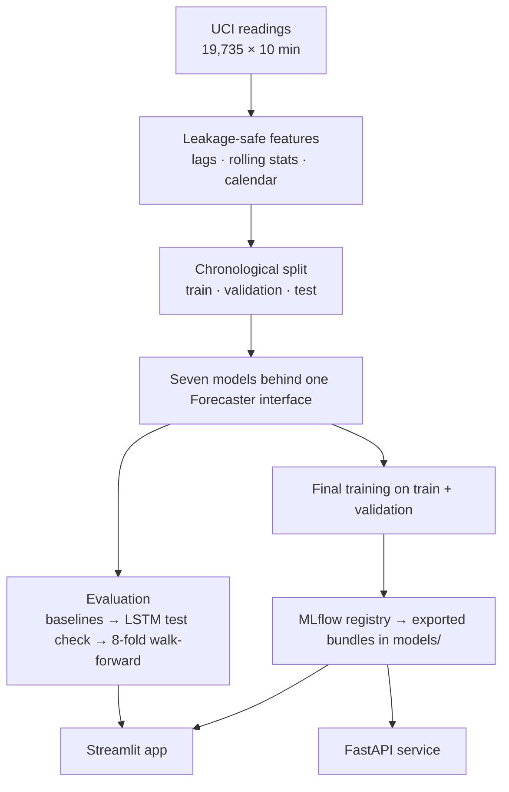
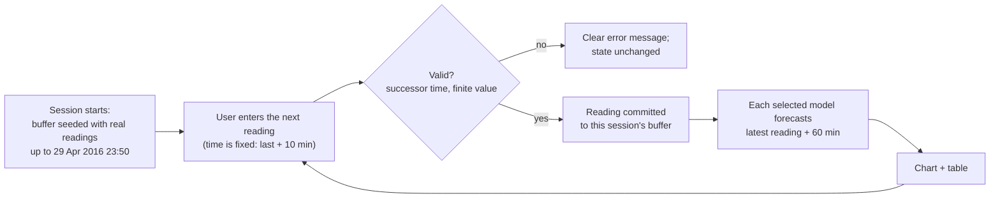
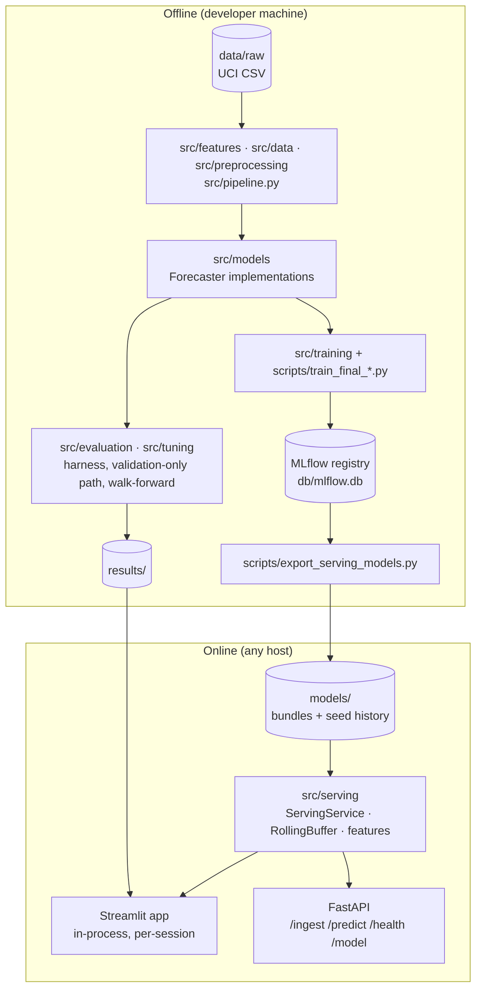
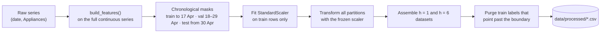
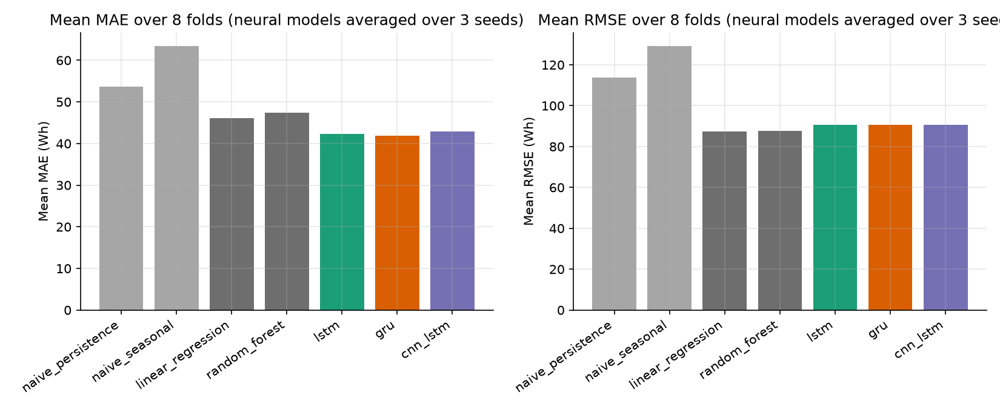
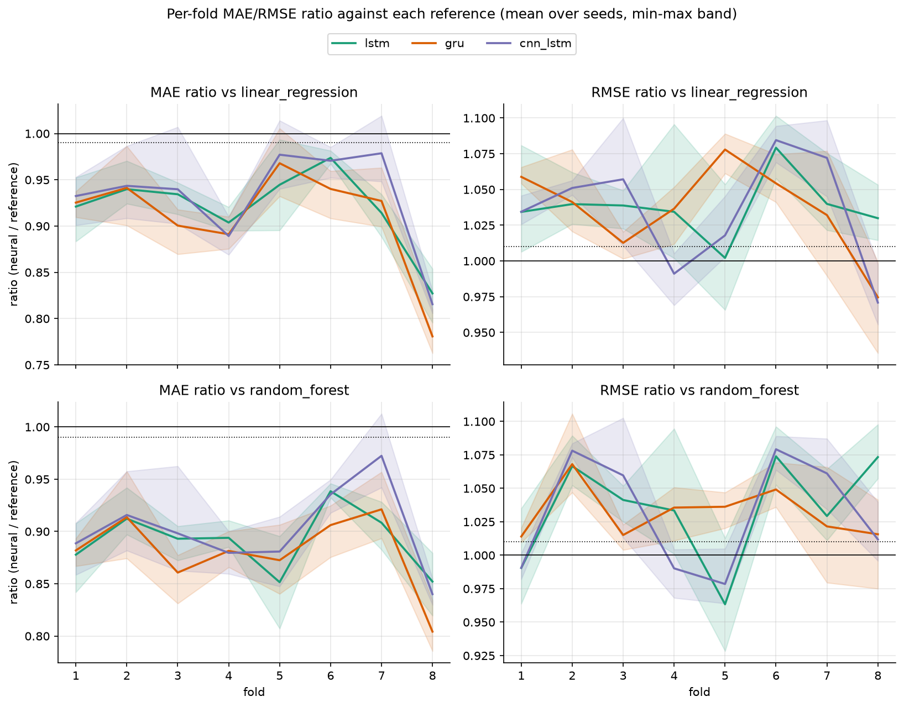

# WattCast: project report

*Forecasting household appliance energy use one hour ahead. A report on method, results and limits for readers who do not want to read the source code.*

---

## 1. Executive summary

WattCast forecasts how much energy a household's appliances will use 60 minutes ahead, from 10-minute meter readings. It compares seven models (two naive baselines, linear regression, a random forest and three deep sequence models: LSTM, GRU and CNN-LSTM) under evaluation rules that were written down and committed before the experiments ran. The five learned models are served through a Streamlit app and a REST API.

**Main findings**

| | |
|---|---|
| Typical error (MAE) | The deep models are lowest: GRU averages **41.85 Wh** across 8 walk-forward weeks, against 46.06 Wh for linear regression. |
| Large errors (RMSE) | Linear regression is lowest at **87.40 Wh**; every deep model is 90.50–90.73 Wh. |
| Pre-registered verdict | **No model is shown better.** All 6 deep-vs-classical comparisons are "not shown", because improving MAE while worsening RMSE does not meet the rule. |
| Held-out test check | Consistent with the above: the LSTM beat the MAE bar with 3 of 3 seeds and missed the RMSE bar with 3 of 3. |
| Deployment | Linear regression is the primary serving model. All five learned models are served live, and serving is tested to match the offline pipeline. |

The main result is therefore a **trade-off, not a winner**: deep sequence models make smaller typical errors and larger big ones. The evaluation design keeps that finding from being reported as a clean victory.

## 2. Problem statement

Short-term appliance load forecasts help a home energy system plan: when to shift flexible loads, or when to expect a peak. The dataset is one house over 4.5 months, and consumption is spiky: the median reading is 60 Wh and the maximum 1,080 Wh.

Two common failures make results in this setting look better than they are:

1. **Leakage.** Features that would not exist at prediction time (same-timestamp sensors, centred averages, scalers fit on future data, random splits) inflate scores.
2. **Selection bias.** Trying many models and settings against one small test set, then reporting the best, manufactures wins.

## 3. Objectives

1. Build a forecasting pipeline in which leakage is prevented by code, not by care.
2. Compare simple and deep models fairly, with rules fixed before seeing results.
3. Serve the models so that live predictions match offline predictions exactly.
4. Package the result so anyone can run it from a clone: an interactive app, an API, and reproducible data.

## 4. Solution overview



The project ran in phases: setup, exploration, features, baselines, LSTM, walk-forward comparison, then serving. Each phase's decisions are recorded in [`decisions.md`](decisions.md), and the dated log written during the work is in [`docs/research-log.md`](docs/research-log.md).

## 5. How the application works

The Streamlit app has five pages:

| Page | What the user does or sees |
|---|---|
| **Overview** | Headline results, computed from the result files, and a system diagram. |
| **Live forecast** | Acts as the meter: enters the next 10-minute reading, and sees every model's forecast for one hour later on a chart and in a table. |
| **Model comparison** | Walk-forward leaderboard (switchable MAE / RMSE / MAPE chart), the six verdicts, the held-out test check, diagnostic figures and per-fold numbers. |
| **Data & features** | Dataset facts, the chronological split, exploration findings, the feature set and which models use each feature. |
| **Method & limitations** | Evaluation protocol, serving design, deployed model versions, limitations. |

**Live forecast flow**



Each browser session has its own buffer, so visitors never see or disturb each other's readings. **Reset** starts the session again from the seed.

## 6. System architecture



| Component | Responsibility |
|---|---|
| `src/features`, `src/data`, `src/preprocessing` | Build leakage-safe features, split chronologically, scale using training data only, purge labels at partition boundaries. |
| `src/models` | The `Forecaster` interface and the naive, sklearn and PyTorch implementations. |
| `src/evaluation`, `src/tuning` | Scoring harness, validation-only tuning path, walk-forward runner and verdict rules. |
| `src/training`, `scripts/` | Final training window, registration in MLflow, export to `models/`. |
| `src/serving` | Bundle loading, the rolling buffer, the serving core, and the FastAPI adapter. |
| `streamlit_app.py`, `report_pages/`, `src/ui` | The app pages and the loaders for recorded results. |

Offline and online are joined by one directory, `models/`. The app and the API never need MLflow, the raw dataset, or a network service.

## 7. Data flow

**Training-time pipeline** (`src/pipeline.py`):



**Serving-time path**: the same `build_features()` runs on the rolling buffer, and the bundle's frozen scaler is applied before the model predicts (see the sequence diagram in the [README](README.md#architecture)).

## 8. Key features

- **Leakage prevention in code.** Lags and rolling windows reject non-positive offsets, windows are never centred, targets reject non-positive horizons, and the scaler is fit on training data only.
- **One interface for all models.** Evaluation and serving never branch on model type.
- **Written rules first.** Success criteria and comparison rules were committed before experiments, and the test partition was used once per seed.
- **Structural test isolation for tuning.** The tuning code is never given test data, and tests check this.
- **Verified serving.** Serving and offline features and predictions agree within tolerances fixed in advance.
- **Portable deployment.** 15 MB of committed model bundles, no secrets, and a single `streamlit run` command.
- **Reproducible inputs.** A checksum-verified download reproduces the exact dataset, and processed data rebuilds byte-for-byte.

## 9. Methodology

### 9.1 Data

| Item | Value |
|---|---|
| Source | [UCI Appliances Energy Prediction](https://archive.ics.uci.edu/dataset/374/appliances+energy+prediction) (Candanedo et al., CC BY 4.0) |
| Size | 19,735 readings × 29 columns, strict 10-minute cadence, no gaps or missing values |
| Period | 2016-01-11 to 2016-05-27 (138 calendar days, one house) |
| Target | `Appliances`: energy used by appliances per 10 minutes (Wh) |
| Split | Train 11 Jan – 17 Apr · Validation 18 – 29 Apr · Test 30 Apr – 27 May |

**Exploration findings that shaped the design** (`notebooks/01_eda.ipynb`):

- Strong daily cycle (overnight trough, evening peak around 18:00), with weekday and weekend profiles of different shape.
- Autocorrelation fades within hours but recurs at the daily lag of 144 steps, so a one-day lag is kept.
- Extremes are plausible ramps rather than sensor errors, so the target is kept unclipped.
- The daily rhythm's amplitude shrinks over the period (median daily P90–P10 range 94 → 74 → 60 Wh). Later periods are a different regime.
- The ADF test rejects a unit root (−21.62), so no differencing is applied.
- Same-timestamp sensors correlate weakly with consumption (all |r| < 0.25).

### 9.2 Features

18 features, all available at the forecast origin:

| Group | Features |
|---|---|
| Lags | `Appliances` 1, 2, 3, 4, 5, 6 and 144 steps back |
| Rolling statistics | Mean and standard deviation over the last 6 and 18 readings |
| Calendar | Hour, weekday, weekend flag; sine/cosine of minute-of-day and weekday |

Sequence models read 18-row windows and drop the raw hour and weekday integers (16 inputs per row).

### 9.3 Models

| Model | Notes |
|---|---|
| Naive persistence | Latest reading, held flat |
| Naive seasonal | Same time yesterday |
| Linear regression | Default settings, squared loss |
| Random forest | 100 trees, default settings |
| LSTM | 1 layer, 64 units, 18-step window, Huber loss (δ = 40 Wh), 50 epochs, Adam 1e-3. Epochs and δ selected on validation from a 12-configuration grid |
| GRU | Same configuration as the LSTM, with a GRU layer (untuned) |
| CNN-LSTM | Conv1d (32 channels, kernel 3) feeding the LSTM configuration (untuned) |

### 9.4 Evaluation protocol

| Stage | Purpose | Rule |
|---|---|---|
| Baseline study | Establish references at h = 1 and h = 6 | Train/validation/test split, 4 non-deep models |
| LSTM test check | One-shot held-out test | Each of 3 seeds must reach ≤ 0.99× linear regression's test MAE **and** RMSE. Test scored once per seed and horizon (6 evaluations in total). |
| Walk-forward comparison | Main model comparison | 8 expanding folds of 7 days (1 Mar – 25 Apr), h = 6, per-fold train-only scaler, 3 seeds for deep models. **Shown better:** mean ratios ≤ 0.99 on both metrics for every seed. **Shown worse:** both ≥ 1.01. Otherwise **not shown**. |
| Serving equivalence | Live path equals offline path | Relative tolerance 1e-12 on features (1e-10 for rolling standard deviation, after one documented amendment) and a 1e-10 Wh floor on predictions |

The walk-forward folds do not touch the test period, which was not used again after the LSTM check.

## 10. Results

### 10.1 Baselines on the held-out test period

Test partition, 30 Apr – 27 May (`tests/fixtures/golden_baselines.json`).

| Model | h = 1 MAE | h = 1 RMSE | h = 6 MAE | h = 6 RMSE |
|---|---:|---:|---:|---:|
| Naive persistence | 26.50 | 66.14 | 47.60 | 103.62 |
| Naive seasonal | 53.72 | 112.29 | 53.78 | 112.36 |
| Linear regression | 27.16 | 59.71 | **42.39** | **80.62** |
| Random forest | 32.46 | 65.87 | 45.12 | 83.06 |

At 10 minutes ahead, the last reading is hard to beat on MAE. At 60 minutes, linear regression is the strongest baseline, and it became the reference.

### 10.2 LSTM held-out test check (h = 6)

| Seed | Test MAE | ≤ 41.97? | Test RMSE | ≤ 79.81? |
|---:|---:|:---:|---:|:---:|
| 42 | 39.31 | yes | 84.19 | no |
| 43 | 38.09 | yes | 81.02 | no |
| 44 | 38.79 | yes | 85.23 | no |

**Verdict: not shown.** The LSTM's typical error is about 9% lower than linear regression's, but its RMSE is higher with every seed. At h = 1 the LSTM's seed-mean test MAE is 28.54 and its RMSE 65.44. On validation the selected configuration beat the reference on both metrics (MAE ratio 0.785, RMSE ratio 0.973); on test it did so on MAE only (0.914 and 1.035). Selection effects and the drift in amplitude are both consistent with that gap, and neither was tested.

### 10.3 Walk-forward comparison (h = 6, 8 folds)



| Model | MAE | RMSE | MAPE (%) |
|---|---:|---:|---:|
| GRU | **41.85** | 90.50 | **34.92** |
| LSTM | 42.37 | 90.73 | 35.89 |
| CNN-LSTM | 42.88 | 90.59 | 36.88 |
| Linear regression | 46.06 | **87.40** | 46.90 |
| Random forest | 47.46 | 87.71 | 49.75 |
| Naive persistence | 53.73 | 113.68 | 47.25 |
| Naive seasonal | 63.44 | 129.23 | 63.36 |

**Verdicts.** Mean ratios per seed (42 / 43 / 44); below 1 means the deep model has lower error.

| Deep model | Reference | MAE ratio | RMSE ratio | Verdict |
|---|---|---|---|---|
| LSTM | Linear regression | 0.919 / 0.915 / 0.926 | 1.045 / 1.023 / 1.044 | Not shown |
| LSTM | Random forest | 0.890 / 0.886 / 0.897 | 1.041 / 1.020 / 1.041 | Not shown |
| GRU | Linear regression | 0.914 / 0.918 / 0.896 | 1.032 / 1.045 / 1.031 | Not shown |
| GRU | Random forest | 0.884 / 0.889 / 0.868 | 1.028 / 1.040 / 1.027 | Not shown |
| CNN-LSTM | Linear regression | 0.927 / 0.922 / 0.944 | 1.031 / 1.028 / 1.046 | Not shown |
| CNN-LSTM | Random forest | 0.897 / 0.893 / 0.913 | 1.027 / 1.025 / 1.042 | Not shown |



Every deep model has 5–13% lower MAE and 2–5% higher RMSE than each reference, with every seed. Restricting to folds 1–6, which do not overlap the LSTM's tuning period, gives the same classification.

### 10.4 Per-fold RMSE (evidence for the serving choice)

Deep models are averaged over 3 seeds.

| Fold | Linear regression | Random forest | LSTM | GRU | CNN-LSTM |
|---:|---:|---:|---:|---:|---:|
| 1 | 84.64 | 88.38 | 87.55 | 89.62 | 87.55 |
| 2 | 89.98 | 87.72 | 93.56 | 93.69 | 94.58 |
| 3 | 92.21 | 91.98 | 95.78 | 93.38 | 97.47 |
| 4 | 89.39 | 89.48 | 92.47 | 92.66 | 88.60 |
| 5 | 73.97 | 76.95 | 74.13 | 79.74 | 75.30 |
| 6 | 87.88 | 88.31 | 94.84 | 92.65 | 95.30 |
| 7 | 99.07 | 100.09 | 103.03 | 102.25 | 106.21 |
| 8 | 82.06 | 78.74 | 84.52 | 79.97 | 79.67 |
| **Mean** | **87.40** | 87.71 | 90.73 | 90.50 | 90.59 |

Linear regression has lower RMSE than LSTM in 8 of 8 folds, GRU in 7 of 8, and CNN-LSTM in 6 of 8. Its edge over random forest disappears if fold 1 is removed, so it is **not** described as better than random forest.

### 10.5 Serving

| Check | Result |
|---|---|
| Feature equivalence (serving vs offline) | Passes; rolling standard deviation needed the documented 1e-10 relative tolerance |
| Prediction equivalence (linear regression) | Passes within 1e-10 Wh |
| Exported bundles vs registry | Bit-identical predictions for all 5 families |
| Latency, linear regression, one ingest + predict | In-process p50 9.2 ms / p95 9.8 ms; over HTTP p50 11.8 ms / p95 14.8 ms (`results/serving_latency.json`, 12-core CPU, synthetic readings) |

## 11. Evaluation: what the results mean

- **A consistent trade-off.** The deep models capture typical behaviour better (MAE is 5–13% lower) but miss large spikes by more (RMSE is 2–5% higher). The direction is the same for every seed, fold subset and reference.
- **Not a tie.** "Not shown" means the pre-set bar for superiority was not met; it does not mean the models are equivalent.
- **Metric choice decides the ranking.** A deployment that cares about typical error would prefer GRU. One that cares about large misses would prefer linear regression. WattCast serves linear regression by default and shows all five.
- **One untested explanation.** The deep models are trained with Huber loss, which down-weights large errors and so favours MAE. Testing that would need a new registered experiment.

## 12. Limitations

| Limitation | Effect |
|---|---|
| One house, one 138-day period | Results may not generalize; the folds are not independent samples. |
| Only the LSTM was tuned | GRU and CNN-LSTM may be under-configured; the tuning advantage is one-sided. |
| Folds 7–8 overlap the LSTM's tuning period | Slight optimism for the LSTM; the folds 1–6 check shows the same verdicts. |
| Declining daily amplitude | Later periods behave differently; this may explain part of the validation-to-test gap. |
| Different loss functions | Deep models use Huber loss, linear regression squared error; the effect was not tested. |
| Post-hoc serving choice | Linear regression was chosen after seeing results, on RMSE only. |
| Consumption and calendar features only | Weather and room sensors are unused. |
| In-memory, single-process serving | The API resets on restart, and the app's demo forecasts are never compared with real outcomes. |

## 13. Deployment

| Target | How |
|---|---|
| **Streamlit Community Cloud** | Point a new app at `streamlit_app.py` on `master`, pick the Python version (tested with 3.14), and deploy. No secrets needed; `requirements.txt` installs everything, including CPU-only PyTorch. |
| **Any container or VM** | `pip install -r requirements.txt && streamlit run streamlit_app.py --server.port $PORT --server.headless true` |
| **REST API** | `pip install -r requirements-dev.txt && uvicorn src.serving.app:app --host 0.0.0.0 --port $PORT` |

Models load once per server process, about 15 MB in total. Each app session holds a 162-row buffer.

## 14. Usage instructions

**Run the app locally**

```bash
pip install -r requirements.txt
streamlit run streamlit_app.py
```

Then open **Live forecast** and:

1. Type the next reading in Wh (most readings are 50–100 Wh; spikes reach several hundred).
2. Click **Add reading**. The time advances by 10 minutes automatically.
3. Compare the five forecasts for one hour after your latest reading. Use the model chips to show or hide models.
4. Click **Reset** to return to the real history.

**Call the API**

```bash
uvicorn src.serving.app:app
curl -X POST localhost:8000/ingest -H 'content-type: application/json' \
     -d '{"timestamp": "2016-04-30T00:00:00", "appliances": 60}'
curl -X POST localhost:8000/predict -H 'content-type: application/json' \
     -d '{"model_families": ["linear_regression", "gru"]}'
```

Interactive API documentation is served at `/docs`. The [README](README.md#reproducing-the-results) lists the commands that reproduce every result.

## 15. Technical stack

| Area | Tools |
|---|---|
| Language | Python 3.14 |
| Data and classical ML | pandas, NumPy, scikit-learn, statsmodels |
| Deep learning | PyTorch (CPU) |
| Tracking and registry | MLflow (local SQLite, `@champion` aliases) |
| Data versioning | DVC hash records, checksum-verified download |
| Serialization | skops, PyTorch state dicts (no pickle) |
| Serving | FastAPI, uvicorn |
| Interface | Streamlit, Altair, Graphviz |
| Quality | pytest (with app smoke tests), ruff |

## 16. Important design decisions

| Decision | Why | Record |
|---|---|---|
| True forecasting, leakage rules in code | Scores must be reproducible live | ADR-001, 002 |
| One `Forecaster` interface | Evaluation and serving never branch on model type | ADR-004 |
| Rules committed before experiments; test used once | Prevents selection bias and moving goalposts | ADR-007, 009 |
| MAE **and** RMSE must both improve | Stops a single favourable metric from deciding | ADR-006 |
| Validation-only tuning code path | Test isolation is demonstrated, not assumed | ADR-008 |
| Linear regression as primary model, all five served | Lowest RMSE; choice disclosed as post-hoc | ADR-012 |
| Seeded, strictly ordered serving buffer | Deterministic restarts, no fabricated data | ADR-014 |
| Exported bundles committed; in-process app | Runs from a clone on any Streamlit host | ADR-016, 017 |

Full records with alternatives and trade-offs are in [`decisions.md`](decisions.md).

## 17. Future improvements

1. **Richer inputs.** Add lagged weather and room-sensor features.
2. **Fair tuning.** Give GRU and CNN-LSTM the same validation search the LSTM had.
3. **Test the loss hypothesis.** Retrain the deep models with squared-error loss as a new registered experiment.
4. **Uncertainty.** Produce prediction intervals, which suit spiky consumption better than point forecasts.
5. **Broader evidence.** Evaluate on more households or longer periods.
6. **Operations.** Persist the API's buffer, add drift monitoring, and run tests in CI on every push.

## 18. Conclusion

WattCast shows that on this household's data, deep sequence models make smaller typical one-hour-ahead errors than linear regression, but larger big ones. Under rules fixed in advance, that is not enough to call them better. The project's value lies as much in how the answer was reached as in the answer: leakage prevented in code, one interface from training to serving, comparisons pre-registered and evaluated once, serving checked against the offline pipeline, and a deployment anyone can run from a clone.
